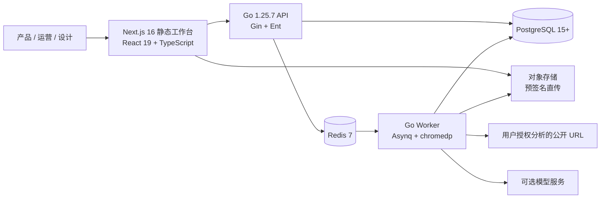
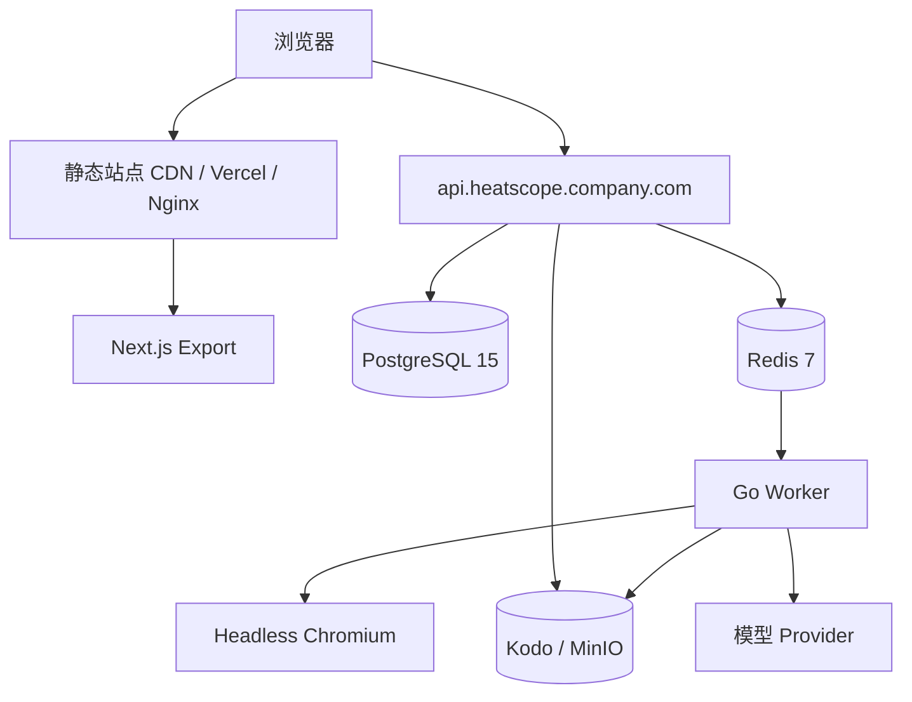

# HeatScope MVP 架构设计文档：Go/Gin 技术栈

> 文档版本：V2.1 MVP 架构评审稿  
> 编写日期：2026-07-29  
> 对应产品需求：[通用网站页面增长诊断与改版闭环平台 PRD V2.0](./PRD-通用网站页面增长诊断与改版闭环平台-V2.0.md)  
> 架构定位：可上线的轻量 MVP，不是终态微服务架构

---

## 1. MVP 架构结论

本版本采用**一个 Go 业务后端 + 一个 Go 异步 Worker + 一个静态导出的 Next.js 工作台**。它满足跨网站项目、文件/截图资产、异步 URL 基线采集、规则分析、可选模型增强、UI 蓝图、导出和基础协作，同时避免 Kubernetes、服务网格、多语言核心服务和复杂数据平台。



### 1.1 MVP 必需组件

| 组件 | 技术选择 | MVP 职责 |
|---|---|---|
| 前端工作台 | Next.js 16 App Router、`output: "export"`、React 19、TypeScript | 项目、导入、映射、诊断、蓝图、导出与协作界面 |
| 后端 API | Go 1.25.7、Gin、Ent | 鉴权、项目/版本/资产元数据、任务创建、规则结果、报告下载权限 |
| 数据库 | PostgreSQL 15+ | 业务事实、权限、任务记录、审计、规范化点击数据 |
| 缓存/队列 | Redis 7 + Asynq | 采集、解析、分析、导出的异步任务与重试 |
| Worker | Go command + chromedp/Headless Chromium | URL 采集、截图、DOM 摘要、文件解析、规则/模型分析、导出 |
| 对象存储 | 公司现有 S3 兼容存储，优先 Kodo/MinIO | 原始 CSV、热力图、页面截图、HTML 摘要、导出文件 |
| UI | Tailwind CSS v4、Radix UI | 工作台组件、可访问性和视觉一致性 |

对象存储虽然不在给定清单中，但它是不可省略的基础设施。不要把截图、原始 CSV 或 PDF 存入 PostgreSQL，也不要让 API 代理大文件上传。

### 1.2 MVP 明确不建设

- Kubernetes、服务网格、Kafka、OpenSearch、数据湖、独立规则微服务；
- 多副本高可用 PostgreSQL/Redis、跨地域容灾、自动扩缩容；
- 自动 A/B 分流、自动发布页面、全站爬取；
- 复杂 SAML/SCIM 生命周期管理；首期只预留 OIDC/JWT 接口；
- Figma 自动写入、设计到代码自动发布；
- 引入第二套前端框架或前端微服务。

---

## 2. 技术栈融合原则

### 2.1 Next.js 静态导出与 Go API 的边界

Next.js 设置 `output: "export"` 后，前端是静态资源，不使用 Next Route Handler、Server Action、服务端会话、ISR 或 API Routes。所有动态数据从浏览器调用 Go API。

好处：前端可部署在 Vercel、CDN、Nginx 或公司静态站点；Go 服务可部署在公司容器平台或内网，URL 采集和密钥不进入前端托管平台。

前端必须通过环境变量构建：

```text
NEXT_PUBLIC_API_BASE_URL=https://heatscope-api.company.com/api/v1
NEXT_PUBLIC_APP_ENV=production
NEXT_PUBLIC_VERCEL_ANALYTICS_ENABLED=false
```

构建时写入的 `NEXT_PUBLIC_*` 不是密钥。模型密钥、对象存储凭据、数据库连接串只能存在 Go API/Worker 的服务端 Secret 中。

### 2.2 前端单技术栈规则

1. **所有前端页面、组件、图表和交互统一使用 React 19 + TypeScript。** 项目流程、表格、表单、诊断、UI 蓝图、权限页面和静态文档均使用 Next/React。
2. Next.js 16 是唯一应用框架；不在项目中引入 Vue、Vite Vue 应用、Web Component 适配层或 iframe 微前端。
3. 新建设计系统组件统一基于 React + Radix UI + Tailwind CSS v4，状态、类型、单测和视觉回归只有一套工具链。
4. 如确有公司现存 Vue 资产需要迁移，应在原系统内维持，或重写为 React 组件后接入 HeatScope；不在本项目保留兼容运行时。

### 2.3 Tailwind、Radix、MDX、Pagefind 与 Analytics

| 技术 | MVP 用法 | 不应使用的场景 |
|---|---|---|
| Tailwind CSS v4 + PostCSS | 所有前端样式、响应式预览、设计 Token 映射 | 由模型直接拼写未经校验的大段 class 字符串 |
| Radix UI | Dialog、Tabs、Select、Tooltip、Popover、Toast、Dropdown 等交互原语 | 业务数据表和复杂画布的强行封装 |
| MDX + next-mdx-remote | 静态产品文档、规则说明、报告模板说明 | 直接渲染用户上传或模型生成的 MDX，避免执行风险 |
| rehype-highlight/highlight.js | 文档中的 API/埋点代码片段 | 不对用户上传 HTML 执行高亮或脚本 |
| Pagefind | 静态帮助中心、方法论、规则文档搜索 | 项目/洞察/点击数据搜索，后者由 PostgreSQL API 完成 |
| Vercel Analytics | 前端部署于 Vercel 时的匿名产品使用分析，可选 | 不用于客户页面热力分析，也不发送项目 URL、截图或业务数据 |

---

## 3. 仓库与运行单元

建议使用 Go Module + pnpm workspace，而非过早引入复杂 Monorepo 编排工具。

```text
heatscope/
├── apps/
│   ├── web/                      # Next.js 16 静态导出工作台
│   ├── api/                      # Go Gin API（cmd/api）
│   └── worker/                   # Go Worker（cmd/worker）
├── internal/
│   ├── auth/                     # JWT/OIDC、RBAC 中间件
│   ├── project/                  # 项目、页面、版本
│   ├── asset/                    # 对象存储预签名、资产元数据
│   ├── importjob/                # CSV/XLSX 解析与字段映射
│   ├── capture/                  # URL Guard、chromedp、快照提取
│   ├── mapping/                  # 元素与模块映射
│   ├── analysis/                 # 数据质量、统计、规则引擎
│   ├── modelgateway/             # 多模型 Provider Adapter
│   ├── blueprint/                # UI Blueprint Schema 与预览数据
│   ├── report/                   # Markdown/CSV/JSON/PDF 导出
│   ├── jobs/                     # Asynq 任务定义与消费者
│   └── audit/                    # 审计记录
├── ent/
│   ├── schema/                   # Ent schema
│   └── migrate/
├── pkg/
│   ├── apierrors/                # RFC 7807 风格错误
│   ├── contracts/                # DTO、JSON Schema、OpenAPI 共享定义
│   └── observability/            # 结构化日志、trace_id
├── docs/
├── deploy/
│   ├── docker-compose.yml
│   ├── api.Dockerfile
│   ├── worker.Dockerfile
│   └── nginx/
└── scripts/
```

API 和 Worker 共用 `internal/` 领域逻辑，但部署为两个进程。这样 URL 采集/模型调用不会阻塞 Gin 请求，也不需要拆成多个远程服务。

---

## 4. MVP 部署拓扑

### 4.1 试点与生产初始部署



建议先用 Docker Compose 部署六个容器：`web-static`、`api`、`worker`、`postgres`、`redis`、`minio`。如果公司已有 PostgreSQL、Redis 和对象存储，Compose 只运行 `web-static`、`api`、`worker`。

### 4.2 环境变量与密钥

| 名称 | 运行单元 | 是否敏感 |
|---|---|---|
| `DATABASE_URL` | API/Worker | 是 |
| `REDIS_ADDR` | API/Worker | 内网配置 |
| `S3_ENDPOINT/BUCKET/ACCESS_KEY/SECRET_KEY` | API/Worker | 是 |
| `JWT_SIGNING_KEY` 或 `OIDC_*` | API | 是 |
| `MODEL_PROVIDER_CONFIG_REF` | Worker | 是，引用密钥系统 |
| `NEXT_PUBLIC_API_BASE_URL` | Web | 否 |

首期可将敏感配置放在 Docker/Kubernetes Secret 或公司密钥平台中；不得写进 Git、Next 构建产物、前端 LocalStorage、模型提示词或日志。

---

## 5. API、Worker 与队列设计

### 5.1 Gin API 职责

Gin 只处理短请求、权限、元数据和任务创建，不同步执行截图、文件解析、模型请求或 PDF 生成。

| API 组 | 典型接口 | 职责 |
|---|---|---|
| Auth | `/auth/me` | 验证 JWT/OIDC，注入用户/组织上下文 |
| Projects | `POST /projects` | 创建项目、目标、设备、URL |
| Assets | `POST /assets/upload-url` | 返回对象存储预签名上传 URL |
| Capture | `POST /snapshots` | 校验 URL，投递采集任务，返回 `job_id` |
| Imports | `POST /imports` | 记录资产和字段映射，投递解析任务 |
| Mapping | `POST /mappings/:id/confirm` | 人工确认模块/元素映射 |
| Analysis | `POST /analysis-runs` | 选择规则/混合/模型模式，投递任务 |
| Blueprints | `POST /blueprints` | 由分析运行生成 UI Schema |
| Reports | `POST /exports` | 创建导出任务，返回下载记录 |
| Jobs | `GET /jobs/:id` | 查询异步任务状态、进度与失败原因 |

统一响应：同步创建返回 `201`，长任务返回 `202`：

```json
{
  "job_id": "job_01J...",
  "status": "queued",
  "poll_url": "/api/v1/jobs/job_01J..."
}
```

### 5.2 Redis 7 + Asynq 队列

使用 `hibiken/asynq` 管理任务。它适合 MVP 的可靠重试、优先级、计划任务和 Dashboard；不需要引入 Kafka。

| 队列 | 任务 | 并发建议 | 重试 |
|---|---|---:|---:|
| `critical` | 数据质量阻断、导出审批 | 2 | 3 |
| `capture` | URL 预检、截图、DOM 摘要 | 2 | 2 |
| `import` | CSV/XLSX 解析、映射建议 | 4 | 3 |
| `analysis` | 规则分析、模型增强、蓝图 | 2 | 2 |
| `export` | Markdown/CSV/JSON/PDF | 2 | 2 |
| `cleanup` | 资产清理、过期预签名记录 | 1 | 1 |

任务载荷只保存 ID，不保存 CSV、截图 base64、模型 Key 或完整页面 HTML：

```json
{"job_id":"...","organization_id":"...","project_id":"...","snapshot_id":"...","actor_id":"..."}
```

所有任务都有 `idempotency_key`。例如采集任务为 `url_hash + viewport + requested_at_bucket`，导入任务为 `asset_sha256 + mapping_version`。Worker 开始时先检查数据库中是否已有同一成功结果，避免重复执行。

### 5.3 Worker 职责

| Worker Handler | 输入 | 输出 |
|---|---|---|
| Capture | URL、视口、项目 ID | PageSnapshot、截图、DOM 摘要、模块树、失败原因 |
| Import | Asset ID、字段模板 | 规范化 ClickObservation、质量报告 |
| Mapping | Snapshot ID、Import ID | 元素/模块候选映射、人工确认队列 |
| Analysis | Version、Imports、模式 | AnalysisRun、洞察、证据、数据层级 |
| Blueprint | AnalysisRun ID | UiBlueprint JSON、HTML preview asset、事件合同 |
| Export | Report ID、格式 | 对象存储文件、短时下载 URL |

---

## 6. 数据设计：Ent + PostgreSQL

### 6.1 Ent 使用原则

1. `ent/schema` 是业务表的唯一建模入口；所有迁移通过 Ent 生成并经评审执行。
2. 查询必须带 `organization_id`/`workspace_id` 作用域；不允许裸查跨项目数据。
3. 原始文件不入库；数据库只保存 asset key、hash、MIME、大小、保留期。
4. 高频点击事实表按导入批次和日期建立索引，数据量增长后按 `observed_date` 月分区。
5. 原始事实 append-only。纠错创建新的 `DataImport` 或 `Override`，不覆盖历史点击记录。

### 6.2 MVP 核心表

| 表/Ent Schema | 关键字段 | 索引/约束 |
|---|---|---|
| `Organization`, `User`, `Membership` | tenant、角色 | `(organization_id,user_id)` 唯一 |
| `Project` | goal、owner、状态 | `(organization_id,updated_at)` |
| `PageSnapshot` | url、final_url、viewport、dom_hash、screenshot_asset_id | `(project_id,dom_hash,viewport)` |
| `PageVersion` | snapshot、label、published_at | `(project_id,version_key)` 唯一 |
| `Asset` | object_key、sha256、kind、size、retention_until | `(organization_id,sha256)` |
| `DataImport` | asset、source_type、range、device、quality_status | `(project_id,created_at)` |
| `ClickObservation` | import、date、element_key、click_count | `(import_id,element_key,observed_date)` |
| `Module`, `ElementMapping` | snapshot、selector、module、confidence | `(snapshot_id,element_key)` |
| `AnalysisRun`, `Insight` | input_hash、rule_version、data_level | `(project_id,created_at)` |
| `UiBlueprint`, `EventContract` | schema_version、approval_status | `(page_version_id,created_at)` |
| `Job`, `AuditEvent` | status、trace_id、actor | `(organization_id,occurred_at)` |

### 6.3 质量闸门存储

`DataImport.quality_report` 使用 JSONB，保存检查项、严重等级、样本行和修复建议；`quality_status` 仅允许：`pending`、`blocked`、`needs_confirmation`、`passed`。

`AnalysisRun` 只有当所有输入 import 为 `passed` 或经具有权限的用户确认后才能进入 `running`。L1 项目在报告模板层和规则层都强制保留数据边界，不能仅靠前端文案约束。

---

## 7. URL 采集与安全设计

### 7.1 采集实现

Worker 使用 `chromedp` 驱动 Headless Chromium，采集公开、用户有权分析的 URL。产物包含：最终 URL、响应状态、指定视口截图、页面标题、可见文本摘要、可交互元素摘要、DOM 哈希、模块候选和设计 Token 候选。

不执行点击、登录、表单提交、支付、下载或页面脚本指令。无法安全采集时，项目进入 `awaiting_source_snapshot`，用户上传原始页面长截图或已批准的 HTML 导出后继续分析。

### 7.2 SSRF 强制防护

1. 仅允许 `http`/`https`，拒绝 `file:`、`data:`、`javascript:` 和自定义协议。
2. URL Guard 在初始请求和每次重定向时解析 DNS，拒绝 loopback、RFC1918、link-local、IPv6 ULA、云 metadata IP、内部域名和保留地址。
3. Headless Chromium 使用无 Cookie/无缓存 profile；禁用下载、文件访问和本地网络访问。
4. 最大重定向 5、渲染超时 45 秒、最大 HTML 10MB、最大页面资源 50MB。
5. Worker 容器只允许经 DNS/egress policy 放行的公网访问，不挂载宿主机目录和云凭据。
6. 不绕过 robots、登录、验证码、反爬或付费墙。失败原因对用户可见。

---

## 8. 分析、模型与 UI Blueprint

### 8.1 规则引擎

规则引擎先在 Go 内实现为可测试 package，不引入通用规则 DSL。每条规则实现：

```go
type Rule interface {
  ID() string
  Version() string
  Evaluate(ctx context.Context, input AnalysisInput) ([]InsightDraft, error)
}
```

`InsightDraft` 必须包括 `evidence_refs`、`data_level`、`confidence`、`alternative_explanations`、`action`、`experiment`、`primary_metric` 和 `guardrails`。没有证据引用的洞察不能进入发布状态。

### 8.2 可选模型服务

模型调用仅在 Worker 中发生，Provider Adapter 支持 OpenAI-compatible Chat Completions 和 Responses API。配置放在服务端 Secret；用户如果需要临时自定义 Key，API 使用一次性加密任务令牌传给 Worker，并在任务完成后删除，不写入项目数据库。

调用流程：

```text
规则分析完成
-> 建立最小化输入（页面摘要、确认映射、脱敏聚合、规则证据）
-> 调用模型
-> 校验 JSON Schema 与 evidence_refs
-> 触发数据层级/敏感词检查
-> 作为“模型增强候选”保存，等待人工审阅
```

模型不可读取原始用户输入框内容、Cookie、密钥或未勾选的热力截图；不可输出“已提升转化/留存”之类超出数据层级的结论。

### 8.3 UI Blueprint Schema

Go 负责生成和校验 Blueprint JSON；Next/React 负责渲染预览。HTML 不是事实源。

```json
{
  "schema_version": "1.0",
  "source_snapshot_id": "snap_xxx",
  "strategy": "activation|selection|promotion|content|form",
  "evidence_refs": ["insight_xxx"],
  "tokens": {"primary_color":"#...","font_stack":"...","density":"compact"},
  "desktop_sections": [],
  "mobile_sections": [],
  "components": [],
  "cta_contracts": [],
  "event_contracts": [],
  "assumptions": []
}
```

服务端校验：每个结构性变更必须引用洞察；每个 CTA 必须定义 `module_id`、`cta_type` 和事件；移动端必须有排序规则；不得出现其他项目/公司遗留文案；未经人工批准不得标记为 `published`。

---

## 9. 前端架构

### 9.1 Next.js App Router 页面组织

```text
app/
├── (auth)/login/
├── (workspace)/projects/
│   ├── page.tsx
│   └── [projectId]/
│       ├── overview/
│       ├── inputs/
│       ├── mapping/
│       ├── insights/
│       ├── blueprint/
│       ├── experiments/
│       └── exports/
├── docs/                         # MDX 静态文档
└── help/search/                  # Pagefind 静态搜索入口
```

因使用静态导出，受保护页面不依赖服务端渲染。前端加载后从 Go API 获取当前用户和项目权限；无权限时 API 返回 401/403，前端跳转登录或展示访问受限状态。

### 9.2 数据访问与状态

- 使用 TanStack Query 或公司已有的 React Query 封装处理 API cache、轮询 job 状态、失效和错误边界。
- 只在浏览器保存短期 UI 偏好和无敏感草稿；项目、模型配置、角色、资产和分析结果不能再依赖 `localStorage`。
- 上传流程：先请求预签名 URL，浏览器直传对象存储，完成后向 API 提交 asset metadata；支持断点失败重试和 SHA-256 校验。
- Radix UI 负责交互可访问性；Tailwind v4 通过设计 Token 和语义 class 维持一致性。

### 9.3 文档与搜索

- `next-mdx-remote` 仅渲染仓库审核后的说明文档和模板；用户/模型生成报告一律作为 Markdown 文本显示或下载，不编译为 MDX。
- Pagefind 在静态构建后索引 `/docs`、`/help`、方法论页面；项目内洞察/报告搜索调用 `GET /search`，由 PostgreSQL 处理。
- Vercel Analytics 仅由 `NEXT_PUBLIC_VERCEL_ANALYTICS_ENABLED=true` 启用，采集 HeatScope 自身匿名访问，不采集客户页面 URL、业务数据或截图。

---

## 10. 认证、权限、审计与对象存储

### 10.1 MVP 认证

MVP 可接入公司现有 OIDC，也可用 Gin 签发短期 JWT。Token 需包含 `sub`、`organization_id`、`roles`、`exp`、`jti`。浏览器使用 HttpOnly Secure Cookie 或内存 token；不把访问 token 放入 LocalStorage。

RBAC 初始角色：`admin`、`analyst`、`editor`、`viewer`。每个 API 都经过组织边界和资源归属检查。

### 10.2 对象存储

```text
org/{organization_id}/project/{project_id}/
  snapshots/{snapshot_id}/desktop.png
  imports/{asset_id}/source.csv
  heatmaps/{asset_id}/heatmap.png
  exports/{export_id}/report.pdf
```

用户上传和下载均使用 10 分钟以内的预签名 URL。下载前 API 再次校验权限；对象 Bucket 不公开；删除采用软删记录与生命周期清理。

### 10.3 审计

记录：登录、URL 提交、资产上传/下载、数据导入、映射确认、模型调用、洞察编辑、蓝图审批、报告导出、删除和权限变更。记录包含 `trace_id`、actor、项目、资源 ID、前后状态 hash 和时间，不记录模型密钥或原始敏感正文。

---

## 11. 可观测性与运维

MVP 不强制建设 Prometheus/Grafana 集群，但必须输出 JSON 结构化日志并保留健康检查：

| 项目 | MVP 实现 |
|---|---|
| 日志 | `slog` JSON，字段含 trace_id、job_id、project_id、organization_id、error_code |
| 健康 | `/healthz`、`/readyz`，检查 PostgreSQL、Redis、对象存储连接 |
| 任务观测 | Asynq Dashboard 仅内网管理员可见；API 提供 job 状态 |
| 指标 | 先输出 Prometheus 格式 `/metrics`，接入与否由公司平台决定 |
| 告警 | Worker 死亡、队列积压、采集失败率、模型失败率、对象存储失败率 |
| 错误 | 统一 `code/message/trace_id/retryable`，前端可展示可操作原因 |

---

## 12. 分阶段交付计划

### Sprint 1：底座与项目资产

- Go/Gin/Ent、PostgreSQL、Redis/Asynq、对象存储、Docker Compose；
- JWT/OIDC 适配接口、组织/项目/RBAC、审计、资产预签名上传；
- Next 静态工作台、React/Radix/Tailwind v4 基础框架；
- 迁移现有三页示例为数据库种子数据。

### Sprint 2：可信输入与 L1 分析

- CSV/XLSX 标准解析、数据源字段模板、`总和` 排除、质量报告；
- 热力图/原始页面截图上传、手动元素/模块映射；
- Go 规则引擎、洞察工作台、Markdown/CSV/JSON 导出；
- 页面版本和数据层级限制。

### Sprint 3：URL 基线与 UI 方案

- chromedp 受限 URL 采集、截图、DOM 摘要、SSRF 防护；
- 模块树/设计 Token 候选、Blueprint Schema、React 高保真预览；
- 事件合同、人工审批、HTML/Markdown 实施包。

### Sprint 4：模型增强与复盘

- Worker 模型网关、Provider Adapter、成本/审计/Schema 校验；
- 版本对比、结果导入、实验复盘限制；
- 部署演练、备份、监控接入和安全测试。

---

## 13. MVP 上线验收

- [ ] 新项目可输入任意公开 URL；采集失败时可上传页面截图继续。
- [ ] 原始 CSV、热力图、页面截图不经过 API 大文件转发，且均受项目权限保护。
- [ ] CSV 汇总行不会重复累计；同名 CTA 缺少模块 ID 时明确不可归因。
- [ ] 采集、导入、分析、蓝图、导出均为异步任务，可重试并有可见失败原因。
- [ ] 仅点击数据的报告固定标记 L1，不输出转化/留存确定性结论。
- [ ] UI 方案输出 JSON Blueprint、桌面/移动端预览、CTA 与事件合同。
- [ ] API、Worker、前端无任何模型密钥和对象存储密钥泄露。
- [ ] URL Guard 安全测试覆盖私网 IP、DNS 重绑定、重定向和 metadata 地址。
- [ ] 在 Docker Compose 环境中，一名分析师可完成“URL/截图 + CSV + 热力图 -> 洞察 -> UI 方案 -> 导出”的闭环。

---

## 14. 后续演进触发条件

下列能力只有满足明确触发条件后再引入：

| 触发条件 | 再引入的能力 |
|---|---|
| 采集/分析长期排队或需要高可用 | Worker 水平扩展、Kubernetes、Redis Sentinel/托管服务 |
| 多数据源和高频同步 | 连接器服务、CDC/批处理编排 |
| 项目/报告全文搜索成为高频需求 | PostgreSQL FTS，之后才评估 OpenSearch |
| 多组织企业 SSO 生命周期要求 | SAML/SCIM、细粒度 ABAC |
| 需要显著性检验和复杂人群分析 | 专用统计计算 Worker 或数据仓库 |
| 设计团队需要交付物联动 | Figma 插件、Code Connect、设计 Token 同步 |

在没有这些触发条件前，保持“Go 单体 API + Redis Worker + PostgreSQL + 对象存储”的边界，才能既满足真实项目的可靠性，又不把 MVP 做成重型平台。
