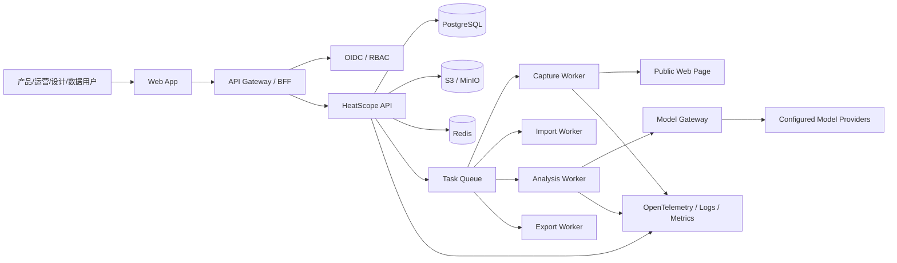
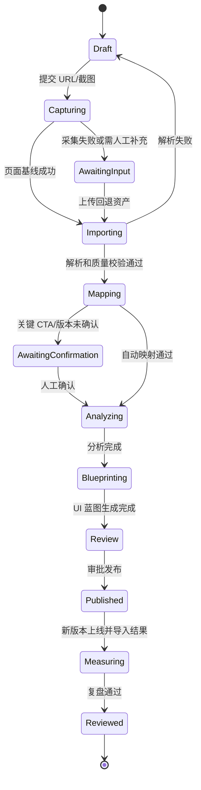
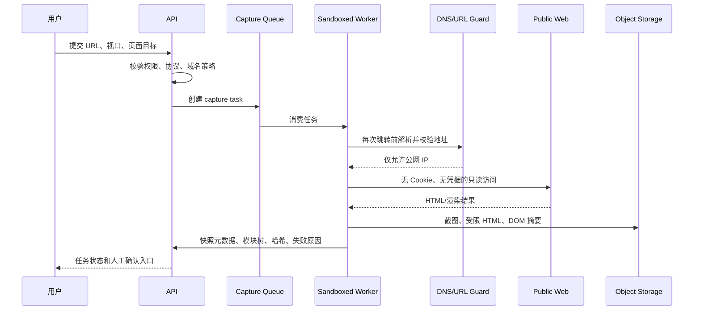
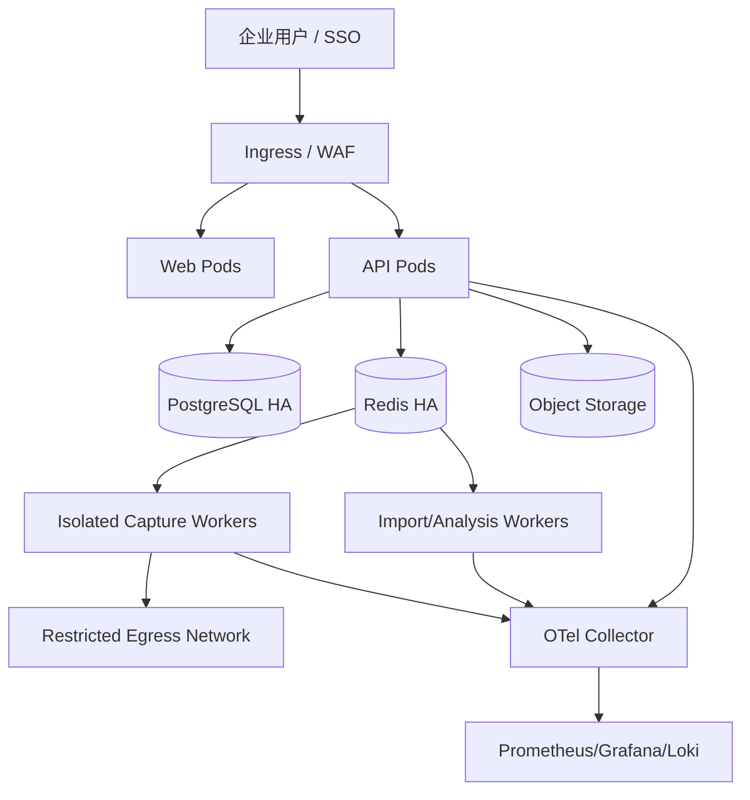

# HeatScope V2.0 架构设计文档

> 文档版本：V2.0  
> 状态：架构评审稿  
> 编写日期：2026-07-29  
> 对应 PRD：[通用网站页面增长诊断与改版闭环平台 PRD V2.0](./PRD-通用网站页面增长诊断与改版闭环平台-V2.0.md)

---

## 1. 架构目标与结论

HeatScope 要从当前“浏览器本地保存三页示例数据的 Vite Demo”升级为一个可部署、可协作、可审计的页面增长诊断平台。目标不是做网页爬虫或自动改版器，而是为用户有权分析的页面提供完整闭环：

`页面版本基线 -> 行为数据 -> 证据化诊断 -> UI 蓝图 -> 事件合同 -> 实验复盘`

### 1.1 核心架构决策

1. **采用 TypeScript Monorepo + 模块化单体 API + 独立 Worker。** 首期不拆微服务；长耗时和高风险的页面采集、文件解析、截图、模型调用、导出全部异步化。
2. **页面快照不可变。** URL 采集、截图、DOM 摘要、视口和哈希构成 `PageSnapshot`；所有数据导入和结论必须绑定快照/版本，防止拿旧热力图解释新页面。
3. **PostgreSQL 是业务事实源，S3/MinIO 是原始资产源，Redis 只负责队列和短期缓存。** 任何报告、分析或模型结果都可追溯回输入版本。
4. **规则引擎先行，模型网关受控补充。** 本地规则输出最低可审计结论；大模型只能根据已脱敏证据生成候选解释、内容和 UI Schema，不能突破数据层级。
5. **URL 采集运行在受限 Worker 沙箱。** 不使用用户 Cookie/凭据，不绕过登录或访问控制，默认阻断私网 IP、重定向 SSRF、超时和下载。
6. **UI 方案以结构化 Blueprint Schema 为主，HTML 预览和导出只是渲染产物。** 这样才能支持未知网站、人工编辑、Figma/代码导出和版本比较。

### 1.2 当前 Demo 与目标架构的差距

| 当前实现 | 生产目标 | 迁移方式 |
|---|---|---|
| 浏览器 `localStorage` 保存项目 | PostgreSQL 的组织、项目、版本、权限和审计 | 保留前端 Demo 作为迁移期只读示例 |
| 静态 `pages.js` 与 URL 特判蓝图 | 快照、模块树、规则策略、Blueprint Schema | 把示例数据导入为种子项目 |
| Vite 中间件/Vercel Function 转发模型 | 独立模型网关、密钥托管、审计、限流 | 移除前端传递长期密钥 |
| 人工上传热力图 | 异步导入、质量校验、资产版本化 | 保留上传并增加快照绑定 |
| 无 URL 抓取、无用户协作 | 受控采集 Worker、RBAC、任务系统 | 先实现公开 URL + 手动回退 |

---

## 2. 非功能性需求

| 维度 | 首期目标 | 架构约束 |
|---|---|---|
| 可用性 | API 月可用性 99.5% | 无状态 API 多副本；异步任务可重试 |
| 性能 | 项目创建 API P95 < 500ms；一次页面采集在 90 秒内给出结果或明确失败 | URL 采集不阻塞 HTTP 请求 |
| 可扩展性 | 支持 100 并发项目操作、20 并发采集任务起步 | Worker 基于队列水平扩展 |
| 一致性 | 报告、分析与输入资产可回溯 | 不可变快照、版本化结果、事务写入 |
| 安全 | 无跨租户资产泄露、无 SSRF 内网访问、无明文模型密钥 | RBAC、对象存储隔离、密钥管理、出站策略 |
| 可观测性 | 每个任务、模型调用、导出都有 trace ID 和审计记录 | 结构化日志 + 指标 + 链路追踪 |
| 可维护性 | 规则、页面策略和数据源映射可独立迭代 | 模块边界和契约测试 |

---

## 3. 总体架构



### 3.1 推荐技术栈

| 层级 | 推荐 | 原因 |
|---|---|---|
| Monorepo | pnpm workspace + Turborepo | Web、API、Worker、共享 Schema 一致发布 |
| Web | React + TypeScript + Vite；TanStack Query/Router | 延续当前前端资产，增强状态、权限和缓存管理 |
| API | NestJS/Fastify + TypeScript | 模块化、OpenAPI、DI、鉴权和队列集成成熟 |
| Worker | Node.js + BullMQ + Playwright | URL 渲染、DOM 与截图能力直接匹配 |
| 规则/解析 | TypeScript；复杂统计可加 Python Sidecar | 与共享 Schema 一致，必要时再扩展科学计算 |
| 关系数据库 | PostgreSQL 16 | 强事务、JSONB、全文搜索、行级权限支持 |
| 队列/缓存 | Redis 7 + BullMQ | 任务状态、延时重试、限速和临时缓存 |
| 对象存储 | S3 兼容服务（生产 S3/OSS/COS，私有部署 MinIO） | 原始 CSV、截图、HTML、导出文件不可放数据库 |
| 身份 | 企业 OIDC/SAML；开发期 Keycloak | 企业 SSO、组同步和 MFA 可复用 |
| 观测 | OpenTelemetry + Prometheus + Grafana + Loki/ELK | 追踪 URL 采集、分析和模型耗时 |
| 部署 | Docker + Kubernetes；试点 Docker Compose | 先可交付，后按 Worker 负载扩容 |

当前 Vite 前端和 Vercel 部署只可作为演示环境；真实项目不得依赖 Vercel Function 承担浏览器采集、长任务、私有网络访问或密钥托管。

---

## 4. 代码仓库与模块边界

```text
heatscope/
├── apps/
│   ├── web/                 # React Web App
│   ├── api/                 # NestJS/Fastify API
│   ├── worker/              # BullMQ consumers
│   └── admin/               # 可选：运维控制台
├── packages/
│   ├── contracts/           # OpenAPI DTO、Zod/JSON Schema、事件定义
│   ├── domain/              # 领域模型、状态机、权限常量
│   ├── analysis-rules/      # 可版本化的本地规则
│   ├── blueprint/           # UI Blueprint Schema、策略与渲染器
│   ├── data-connectors/     # Clarity/神策/CSV/XLSX 映射器
│   ├── page-intelligence/   # DOM 分块、Token 提取、元素匹配
│   └── observability/       # 日志、Trace、指标封装
├── infra/
│   ├── docker/
│   ├── helm/
│   ├── terraform/
│   └── migrations/
└── docs/
```

### 4.1 API 模块

| 模块 | 职责 | 禁止承担的职责 |
|---|---|---|
| Auth & Organization | SSO、成员、角色、项目隔离 | 直接解析文件或采集网页 |
| Project & Version | 项目、页面、快照、发布版本状态机 | 计算指标 |
| Asset & Import | 上传凭证、资产元数据、字段映射、质量结果 | 在 API 请求内处理大文件 |
| Capture | 创建采集任务、查询快照结果 | HTTP 同步渲染网页 |
| Mapping | 元素、模块、热力图映射和人工确认 | 生成业务结论 |
| Analysis | 发起规则/模型分析、存储证据化结果 | 直接调用外部模型供应商 |
| Blueprint | 保存 UI Schema、预览版本、审批和导出 | 访问第三方网站 |
| Experiment | 事件合同、结果导入、复盘 | 代替实验平台分流 |
| Report | 导出任务、模板、下载权限 | 在请求内生成大型 PDF |
| Audit | 审计不可篡改事件、管理员查询 | 承担业务写模型 |

---

## 5. 关键数据模型

### 5.1 租户与权限

```text
organizations 1---* workspaces 1---* projects
organizations 1---* memberships *---1 users
projects 1---* project_members (可选细粒度授权)
```

角色：`org_admin`、`workspace_admin`、`analyst`、`product_manager`、`operator`、`designer`、`data_engineer`、`viewer`。

数据库层采用 `organization_id` 和 PostgreSQL Row Level Security 双重隔离；API 中间件把 OIDC 的用户、组织、角色映射到数据库 session variables。对象存储的下载地址使用短时签名 URL，路径按 `organization_id/project_id/asset_id` 隔离。

### 5.2 领域实体

| 实体 | 不可变字段 | 可变字段 | 说明 |
|---|---|---|---|
| Project | id, organization_id, created_at | name, goal, owner, status | 一个待优化页面项目 |
| PageSnapshot | id, source_url, final_url, viewport, dom_hash, screenshot_hash | capture_status, retention_until | 某时刻页面事实基线 |
| PageVersion | id, project_id, snapshot_id, version_key | label, published_at, status | 把快照与业务发布版本关联 |
| DataImport | id, asset_id, source_type, source_hash | mapping_config, quality_status | 原始导入及其解析结果 |
| ClickObservation | import_id, element_key, date, count | 无 | 规范化点击事实表，严禁直接改写 |
| ModuleMapping | snapshot_id, element_key, module_id | confidence, confirmed_by | 数据元素与视觉模块映射 |
| AnalysisRun | id, inputs_hash, rule_set_version, model_policy | status, summary | 一次可复现分析 |
| Insight | analysis_run_id, evidence_json | priority, owner, status | 可人工工作流化的洞察 |
| UiBlueprint | id, inputs_hash, schema_version | content, approval_status | UI 方案的真实源文件 |
| EventContract | blueprint_id, event_name, schema | status, validated_at | 埋点实施契约 |
| ExperimentResult | plan_id, input_import_ids | outcome, caveats, review_status | 复盘产物 |

### 5.3 存储分层

| 数据 | 存储 | 保留策略 |
|---|---|---|
| 原始 CSV/XLSX、截图、HTML 快照、PDF | 对象存储 | 项目级配置，默认 180 天 |
| 规范化点击/映射/洞察/权限 | PostgreSQL | 活跃项目长期保存 |
| DOM 摘要和设计 Token | PostgreSQL JSONB；大文件可放对象存储 | 与快照绑定 |
| 队列载荷、限速状态 | Redis | 短期 TTL，不作事实源 |
| 模型密钥 | KMS/Vault 引用 | 不进入数据库、日志或浏览器 |
| 审计记录 | PostgreSQL append-only 表 + 归档 | 至少 1 年或按合规策略 |

---

## 6. 异步任务与状态机

### 6.1 队列设计

| 队列 | 任务 | 并发与限制 | 幂等键 |
|---|---|---|---|
| `capture` | URL 校验、渲染、截图、DOM 分块 | 域名限速 + Worker 池 | `snapshot:url_hash:viewport:fingerprint` |
| `import` | 文件解析、字段映射、质量校验 | CPU/内存配额 | `asset_hash:mapping_version` |
| `mapping` | 元素匹配、截图区域建议 | 低优先级可重试 | `snapshot:import:mapper_version` |
| `analysis` | 本地规则、模型增强、洞察聚合 | 按组织配额 | `version:import_set:rule_version:model_policy` |
| `blueprint` | 策略选择、Schema 生成、预览渲染 | 按模型/CPU 资源限制 | `analysis_run:blueprint_version` |
| `export` | Markdown/PDF/CSV/JSON | 单任务文件大小限制 | `report_version:format` |
| `cleanup` | 资产到期、孤儿对象、归档 | 夜间批处理 | `asset_id:retention_version` |

### 6.2 分析项目状态机



任务执行使用 Outbox Pattern：业务事务提交后写 `outbox_events`，独立 dispatcher 投递 Redis。Worker 完成后以乐观锁更新状态和结果版本，重复消息通过幂等键安全忽略。

---

## 7. 页面采集与 SSRF 安全设计

页面采集是产品最危险的入口，必须独立于 API 和普通 Worker 运行。

### 7.1 采集请求流程



### 7.2 强制安全策略

1. 只允许 `http`、`https`；拒绝 `file`、`data`、`javascript`、自定义协议。
2. DNS 解析后拒绝 loopback、link-local、RFC1918 私网、IPv6 ULA、metadata IP、内部域名和保留网段；每次重定向都重新校验。
3. 不允许自定义 Header、Cookie、Authorization、客户端证书或代理地址。
4. 单次最大重定向 5 次、HTML 最大 10MB、资源总量最大 50MB、渲染超时 60 秒、截图最长高度受限。
5. Worker 运行在无挂载宿主机目录、无云元数据访问、最小出站网络策略的容器/Pod。
6. 遵守用户授权范围、站点 robots/访问策略；采集失败必须走“用户上传页面截图/HTML”回退，不能尝试绕过。
7. 不自动点击、填表、登录、购买、下载或执行用户页面中的指令。

---

## 8. 数据导入、校验与映射链路

### 8.1 导入流程

1. Web 从 API 获取对象存储预签名上传 URL；浏览器直接上传，API 不承载大文件。
2. `import` Worker 检测文件格式、编码、表头、行数、文件哈希和恶意内容。
3. 连接器将源字段映射到标准 Schema，原始数据保留在对象存储，规范化数据批量写入 PostgreSQL。
4. 质量引擎执行 `总和/Total` 排除、日期/设备/URL/版本检查、重复记录检查、同名 CTA 风险检查和隐私字段识别。
5. 映射 Worker 将 `selector/id -> DOM element -> module`；不确定项进入人工确认队列。
6. 只有通过 P0 质量门槛的数据可触发正式分析。

### 8.2 计算边界

- 原始点击数据是 L1 事实，所有聚合结果必须可追溯到 `ClickObservation`。
- 热力图截图只支持页面空间定位和人工校验，不能从颜色计算点击量。
- 仅有点击次数时，系统使用“点击观察、可能、建议验证”；页面 PV/UV、曝光、转化、留存分别升级至 L2/L3/L4。
- `ClickObservation` 为 append-only；修正通过新 import 或 override record 表达，不能覆盖原始事实。

---

## 9. 规则引擎、模型网关与 UI 蓝图

### 9.1 本地规则引擎

规则包按版本发布，格式为 `RuleDefinition + InputContract + Evaluator + EvidenceTemplate + Guardrail`。每个 `AnalysisRun` 记录：输入快照、导入版本、规则版本、执行时间、触发规则、未触发原因和输出哈希。

规则引擎示例：

```text
rule: duplicated_cta_unattributed
when: 同名 CTA 跨 module_id 出现，且 module_id 缺失
evidence: CTA 名称、出现次数、点击记录数
result: P0 数据归因缺口
action: 补充 module_id/product_id/cta_type 和 module_exposure
constraint: 不得将同名 CTA 聚合归因到具体模块
```

### 9.2 模型网关

模型网关是 API 内部服务，不暴露给浏览器直接调用。

| 能力 | 设计 |
|---|---|
| Provider Adapter | OpenAI Chat Completions/Responses 及兼容供应商适配器 |
| Secret | 组织管理员在 Vault/KMS 录入；应用只持有短时解密令牌 |
| Input Policy | 仅发页面摘要、已确认模块、脱敏聚合、规则证据、用户勾选截图 |
| Output Policy | JSON Schema 校验、引用证据 ID、禁止词/数据层级检查 |
| Reliability | 超时、重试、熔断、每组织配额、成本预算 |
| Audit | provider、model、token/cost、输入哈希、输出哈希、执行人、trace ID |

模型输出不能直接发布。它必须与规则结果合并后进入人工审阅，且正式报告要标明“本地规则”“模型增强”或“人工编辑”的来源。

### 9.3 Blueprint Schema

UI 方案的核心是可版本化 JSON，而不是一段 HTML 字符串。

```json
{
  "schemaVersion": "1.0",
  "pageStrategy": "activation",
  "sourceSnapshotId": "snap_xxx",
  "evidenceRefs": ["insight_xxx"],
  "designTokens": {"primary": "#...", "fontStack": "...", "density": "compact"},
  "desktop": {"sections": []},
  "mobile": {"sections": [], "stickyCta": {}},
  "components": [],
  "ctaContracts": [],
  "eventContracts": [],
  "assumptions": [],
  "reviewStatus": "draft"
}
```

生成流水线：

1. `page-intelligence` 从快照提取模块树和设计 Token。
2. `analysis-rules` 将洞察定位到模块与漏斗阶段。
3. `blueprint` 根据页面目标和策略生成候选 Schema。
4. 校验器检查：所有 CTA 是否有事件、所有结构性变化是否引用洞察、移动端是否定义、是否出现跨项目品牌文案。
5. HTML Preview Renderer 仅渲染通过校验的 Schema；后续 Figma/代码导出也消费同一 Schema。

---

## 10. 外部与内部 API 契约

所有 HTTP API 使用 `/api/v1`、OIDC Bearer Token、`organization_id` 作用域、OpenAPI 文档和 idempotency key。长任务返回 `202 Accepted + job_id`。

| API | 方法 | 说明 |
|---|---|---|
| `/projects` | POST | 创建项目、目标、URL、视口 |
| `/projects/{id}/captures` | POST | 创建 URL 采集任务 |
| `/projects/{id}/assets/upload-url` | POST | 获取预签名上传 URL |
| `/imports` | POST | 创建解析任务和字段映射 |
| `/mappings/{id}/confirm` | POST | 人工确认元素/模块映射 |
| `/analysis-runs` | POST | 触发规则或模型增强分析 |
| `/blueprints` | POST | 生成 UI Blueprint |
| `/blueprints/{id}/approve` | POST | 审批并锁定发布版本 |
| `/event-contracts/{id}/validate` | POST | 回填埋点验收 |
| `/reports` | POST | 创建导出任务 |
| `/jobs/{id}` | GET | 查询任务状态和失败原因 |
| `/audit-events` | GET | 管理员审计查询 |

API 使用 Problem Details 错误格式，至少含 `code`、`message`、`trace_id`、`retryable`。例如 `CAPTURE_BLOCKED_PRIVATE_IP`、`IMPORT_VERSION_MISMATCH`、`ANALYSIS_DATA_LEVEL_LIMITED`。

---

## 11. 部署拓扑与环境

### 11.1 环境划分

| 环境 | 用途 | 数据原则 |
|---|---|---|
| local | 开发与契约测试 | 使用脱敏样例和 MinIO/Postgres 容器 |
| dev | 集成测试 | 不接生产数据源和生产模型密钥 |
| staging | 预发布和采集安全测试 | 使用隔离组织与测试域名 |
| production | 正式协作 | SSO、备份、审计、监控全开 |

### 11.2 生产拓扑



### 11.3 容灾与备份

- PostgreSQL：每日全量、持续 WAL 归档，RPO 24 小时起步，关键客户可设 RPO 1 小时。
- 对象存储：版本化、生命周期、跨可用区冗余；删除采用软删 + 延迟物理清除。
- Redis：可重建，不保存业务唯一事实；任务通过数据库 Outbox 恢复。
- Worker：任务最大重试 3 次，超过后进入 Dead Letter Queue 并创建可见告警。
- 发布：数据库迁移向后兼容，蓝绿/滚动发布，规则和 Blueprint Schema 均保留兼容期。

---

## 12. 可观测性与审计

### 12.1 必备指标

- `capture_success_rate`、`capture_duration_seconds`、`capture_blocked_ssrf_total`
- `import_parse_success_rate`、`mapping_confirmation_rate`、`quality_gate_failure_total`
- `analysis_duration_seconds`、`rule_trigger_total`、`data_level_distribution`
- `model_request_total`、`model_cost_total`、`model_schema_reject_total`
- `blueprint_validation_failure_total`、`report_export_success_rate`
- `queue_depth`、`job_retry_total`、`dead_letter_total`
- `authorization_denied_total`、`signed_url_access_total`

### 12.2 审计事件

审计表采用 append-only：登录、成员权限变更、URL 创建、资产上传/下载、数据导入、模型调用、洞察编辑、蓝图审批、事件合同确认、报告导出、删除和数据保留策略变更。

每条事件包含：`occurred_at, actor_id, organization_id, project_id, action, resource_type, resource_id, before_hash, after_hash, trace_id, ip_hash`。

---

## 13. 测试策略

| 层级 | 内容 | 阻断条件 |
|---|---|---|
| 单元测试 | CSV 解析、总和排除、数据层级、规则、Schema 校验 | 规则越级结论或计算错误 |
| 契约测试 | Web/API、API/Worker、模型 Provider Adapter | DTO 或事件合同不兼容 |
| 集成测试 | PostgreSQL、Redis、对象存储、任务重试 | 任务无法幂等恢复 |
| 安全测试 | SSRF、重定向、私网 DNS、签名 URL、RBAC | 可访问内网或跨租户资产 |
| E2E | URL -> 上传 -> 映射 -> 分析 -> Blueprint -> 导出 | 主闭环不可完成 |
| 视觉回归 | Blueprint 桌面/390px 移动端截图 | 溢出、重叠、缺失 CTA |
| 人工验收 | 映射准确性、洞察证据、UI 方案可实施性 | 未达到 PRD 验收标准 |

---

## 14. 实施路线图

### 阶段 0：工程底座（2-3 周）

- Monorepo、Docker Compose、PostgreSQL、Redis、MinIO、OIDC 开发环境；
- 组织/项目/RBAC/审计、资产预签名上传、任务框架、OpenAPI；
- 将当前三页 Demo 数据转为种子项目，删除生产依赖 `localStorage`。

### 阶段 1：可信输入与 L1 闭环（3-5 周）

- 公共 URL 受控采集 + 截图/HTML 回退；
- CSV/XLSX 数据源模板、质量门槛、元素/模块人工映射；
- 本地规则引擎、洞察工作流、Markdown/CSV/JSON 导出；
- 支持任意网站，但 UI 方案先使用通用策略 + 页面 Token。

### 阶段 2：高质量 UI 蓝图与协作（3-5 周）

- 设计 Token、模块树、Blueprint Schema、高保真预览、移动端规则；
- 事件合同、审批、任务、版本对比；
- 模型网关、多 Provider、Schema/证据校验和成本审计。

### 阶段 3：结果验证与企业化（持续迭代）

- PV/UV、曝光、转化和实验平台接入；
- 复盘结果、数据源定时同步、知识库检索；
- Kubernetes、SSO/SAML、私有部署采集代理、备份与 SLA。

---

## 15. 关键架构验收清单

- [ ] 新项目不依赖任何预置品牌、页面名称或 URL 特判。
- [ ] 所有分析、蓝图和报告可定位到 `PageSnapshot + DataImport + RuleSet/ModelPolicy`。
- [ ] URL 采集无法访问私网、元数据地址、登录态或用户凭据。
- [ ] 大文件、截图、网页渲染、模型调用和 PDF 导出不阻塞 API 线程。
- [ ] CSV 汇总行不会导致双算；同名 CTA 无模块 ID 时不能伪归因。
- [ ] L1 报告无法生成“转化提升/留存提升”确定性文案。
- [ ] UI Blueprint 有 Schema、版本、人工审批、移动端约束和事件合同。
- [ ] 模型密钥不出现在浏览器、本地存储、日志、报告或审计事件正文中。
- [ ] 删除项目后对象资产按保留策略可恢复或可验证清除。
- [ ] 采集、导入、分析和导出任务均有 trace ID、可重试状态和失败原因。

