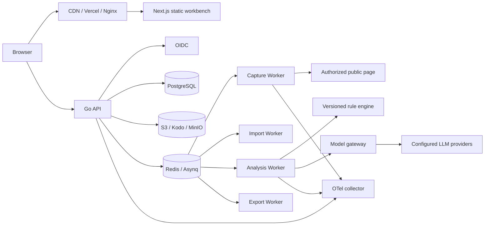
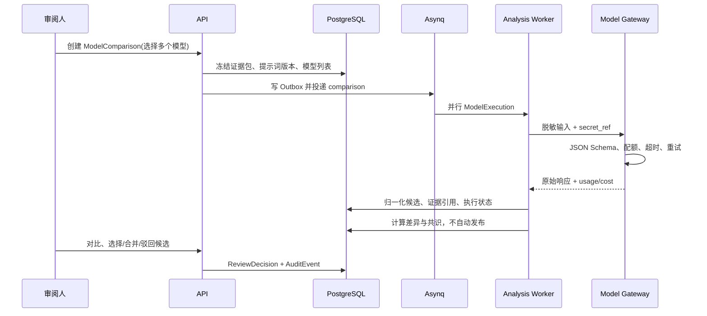

# HeatScope 生产版架构设计文档

> 文档版本：V3.0
> 状态：实施基线
> 编写日期：2026-07-29
> 对应需求：[通用网站页面增长诊断与改版闭环平台 PRD V2.0](./PRD-通用网站页面增长诊断与改版闭环平台-V2.0.md)

## 1. 范围与架构结论

HeatScope 是一个多租户、可协作、可审计的页面增长诊断系统，不是浏览器本地 Demo。它以不可变页面版本和导入批次为事实边界，完成：

```text
授权 URL / 页面截图
  -> 页面快照与版本
  -> 点击数据、热力图与质量校验
  -> 元素/模块确认
  -> 规则分析
  -> 多模型并行评审与差异比较
  -> 人工裁决后的洞察与 UI Blueprint
  -> 事件合同、实验、结果回填与复盘
```

正式版采用**模块化单体 API + 可水平扩展的 Worker 池**，而不是过早拆分微服务。

| 层 | 技术 | 生产职责 |
| --- | --- | --- |
| Web | Next.js 16 静态导出、React 19、TypeScript、Tailwind v4、Radix UI | 项目工作台、审阅、对比、权限内的导入/下载 |
| API | Go 1.25.7、Gin、Ent、OpenAPI | 鉴权、RBAC、业务事务、签名上传、任务创建、查询与审计 |
| Worker | Go、Asynq、chromedp | URL 快照、导入、映射、规则、模型、Blueprint、导出 |
| 数据 | PostgreSQL 15+、Redis 7、S3 兼容对象存储 | 事实源、队列、原始资产与导出物 |
| 身份与密钥 | OIDC/OAuth2、企业 KMS/Vault | SSO、组织隔离、模型密钥引用 |
| 可观测性 | OpenTelemetry、Prometheus、Grafana、Loki | trace、指标、告警、审计关联 |
| 部署 | Docker、Kubernetes、Helm、Terraform | 环境隔离、扩缩容、密钥注入和升级 |

Next 静态站点不承载 API、模型 Key、网页采集或长任务。所有敏感与动态行为都在 Go API / Worker 内执行。

## 2. 生产拓扑



### 2.1 运行单元

1. `api`：无状态、至少两个副本；只处理鉴权、读写事务、任务投递和签名 URL。
2. `worker-capture`：独立网络策略、无用户 Cookie/凭据、Chromium 隔离容器。
3. `worker-import`：解析 CSV/XLSX、字段映射、质量校验、规范化写入。
4. `worker-analysis`：规则和模型执行；按组织、Provider、模型分别限流。
5. `worker-export`：Markdown/CSV/JSON/PDF，写对象存储后返回短时下载 URL。
6. `dispatcher`：从 PostgreSQL Outbox 可靠投递 Asynq，避免“数据库写成功但任务丢失”。

## 3. 领域模型与租户隔离

所有业务表必须有 `organization_id`，API 在事务开始时设置 PostgreSQL RLS session variable。对象路径固定为：

```text
org/{organization_id}/project/{project_id}/asset/{asset_id}
```

### 3.1 核心实体

| 实体 | 关键字段 | 说明 |
| --- | --- | --- |
| Organization / Membership / RoleBinding | `organization_id`, `subject_id`, `role` | OIDC 用户与组织、工作区、项目权限 |
| Project | `goal`, `status`, `owner_id` | 一个页面优化项目 |
| PageSnapshot | `final_url`, `viewport`, `dom_hash`, `screenshot_asset_id` | 不可变页面基线 |
| PageVersion | `project_id`, `snapshot_id`, `version_key`, `published_at` | 业务发布版本 |
| Asset | `sha256`, `object_key`, `kind`, `retention_until` | 原始 CSV、截图、HTML、导出物 |
| DataImport / ClickObservation | `mapping_version`, `source_row`, `element_key`, `count` | append-only 的导入事实 |
| Module / ElementMapping | `snapshot_id`, `module_id`, `element_key`, `confidence` | DOM/截图/数据三者映射及人工确认 |
| RuleSet / AnalysisRun / Insight | `version`, `input_hash`, `evidence_refs` | 可复现规则分析与洞察 |
| ModelProvider / ModelProfile | `secret_ref`, `endpoint_policy`, `model_id` | 组织级模型连接，仅存密钥引用 |
| ModelComparison / ModelExecution | `frozen_input_hash`, `prompt_version`, `status`, `cost` | 同一输入的多模型评审批次和单模型执行 |
| CandidateArtifact / ReviewDecision | `execution_id`, `kind`, `normalized_json`, `decision` | 归一化候选洞察/方案/Blueprint 与人工裁决 |
| UiBlueprint / EventContract / Experiment | `schema_version`, `review_status`, `page_version` | 实施与验证的正式产物 |
| Export / AuditEvent / OutboxEvent | `request_hash`, `trace_id`, `actor_id` | 导出、审计和可靠异步投递 |

### 3.2 多模型对比的数据不变量

一个 `ModelComparison` 必须冻结：

- `analysis_run_id`、页面快照、导入批次、元素映射版本和规则集版本；
- 完整的脱敏证据包哈希 `frozen_input_hash`；
- 提示词模板版本、JSON Schema 版本和温度/推理强度策略；
- 参与的模型 Profile 列表和执行次序。

因此不同模型只在推理能力上不同，不能使用不同输入或不同提示词进行“伪比较”。重新运行必须新建 comparison，不覆盖旧结果。

## 4. 多模型分析与评审

### 4.1 Provider 与密钥

组织管理员创建 `ModelProfile`，填写供应商、模型、Base URL、协议、配额和 KMS/Vault `secret_ref`。浏览器只提交密钥到专用一次性写入接口，API 加密后写入 Vault；之后 API、数据库、日志、导出和模型提示词均不出现明文 Key。

适配器支持：

| 适配器 | 协议 | 统一能力 |
| --- | --- | --- |
| OpenAI Responses | `/responses` | 推理强度、结构化输出、图像输入 |
| OpenAI Chat Compatible | `/chat/completions` | JSON Object / JSON Schema 输出 |
| 企业兼容 Provider | allowlist Base URL | 按连接配置协议和模型 |

Endpoint 只能选择组织管理员批准的域名或经 DNS/私网校验通过的公网地址；模型出站也使用 SSRF 防护和域名 allowlist。

### 4.2 并行执行流程



### 4.3 输出归一化与评分

所有模型必须返回 `InsightCandidateSchema`、`PlanCandidateSchema`、`BlueprintCandidateSchema`，每项至少包含：

```json
{
  "claim": "结论",
  "evidenceRefs": ["click_observation:..."],
  "confidence": "low|medium|high",
  "action": "具体页面动作",
  "validation": {"metric": "", "guardrail": ""},
  "assumptions": ["缺少什么数据"]
}
```

系统计算但不代替人工的评分：

| 维度 | 规则 |
| --- | --- |
| 证据覆盖率 | claim 是否引用已冻结证据 ID |
| 数据层级合规 | L1 不得出现已提升转化/留存等断言 |
| 可实施性 | 是否包含页面动作、事件和验收指标 |
| 冗余与冲突 | 候选间语义去重、相互矛盾标记 |
| 成本与时延 | 实际 token、供应商价格表和执行耗时 |
| 人工评分 | 审阅人可对准确性、洞察、新颖性、可执行性打分 |

对比页必须显示每个候选的原文、规范化内容、证据卡、失败/截断原因、模型版本、提示词版本、耗时、Token/成本。默认不由“多数模型投票”自动发布；审阅人可选择一个候选、逐项合并或退回重跑。

## 5. API 与异步契约

所有接口以 `/api/v1` 开头，返回 RFC 7807 风格错误；写操作需 `Idempotency-Key`。长任务统一返回 `202`：

```json
{"job_id":"job_...","status":"queued","poll_url":"/api/v1/jobs/job_..."}
```

| 组 | 关键接口 |
| --- | --- |
| Auth / RBAC | `GET /me`、`GET/POST /organizations/:id/members`、`GET/POST /roles` |
| Project / Version | `POST /projects`、`GET /projects/:id`、`POST /projects/:id/versions` |
| Asset / Import | `POST /assets/upload-url`、`POST /imports`、`GET /imports/:id/quality` |
| Capture / Mapping | `POST /snapshots`、`POST /mappings/:id/confirm` |
| Analysis | `POST /analysis-runs`、`GET /analysis-runs/:id`、`POST /insights/:id/review` |
| Model Profiles | `POST /model-profiles`、`POST /model-profiles/:id/secret`、`POST /model-profiles/:id/test` |
| Model Comparison | `POST /model-comparisons`、`GET /model-comparisons/:id`、`POST /model-comparisons/:id/decisions` |
| Blueprint / Experiment | `POST /blueprints`、`POST /blueprints/:id/approve`、`POST /experiments`、`POST /experiment-results` |
| Export / Audit | `POST /exports`、`GET /exports/:id/download`、`GET /audit-events` |

Asynq 任务载荷只允许 ID 与版本：`organization_id`、`project_id`、`job_id`、`comparison_id`；严禁放 CSV、截图 Base64、HTML、模型 Key 或完整提示词。

## 6. 安全、可靠性与合规

1. API 使用 OIDC JWT 验证和权限中间件；数据库启用 RLS，后台任务执行前再次校验组织归属。
2. 资产采用预签名 URL、最大大小/MIME 白名单、SHA-256、病毒扫描和保留策略；下载 URL 最长 15 分钟。
3. Capture Worker 运行在受限网络命名空间；每次 DNS 解析和重定向都拒绝 loopback、私网、link-local、metadata 和保留网段。
4. 模型网关记录输入/输出哈希、成本和 trace，不记录明文 Key、完整原始页面、表单输入或未经同意的截图。
5. 任务使用 Outbox、幂等键、指数退避、死信队列和可重放审计。数据库写入采用乐观锁状态机。
6. 生产配置通过 Vault/KMS/Kubernetes Secret 注入；禁止 `NEXT_PUBLIC_*` 包含密钥。

## 7. 可观测性与质量门

每个 HTTP 请求、异步任务和模型执行生成 `trace_id`，关联 `organization_id`、`project_id`、`job_id`、`comparison_id`。指标至少包括：

- API P50/P95、失败率、授权拒绝数；
- 队列等待时间、任务重试、死信数量、采集/导入/分析成功率；
- Provider 成功率、限流、超时、成本、JSON Schema 失败率；
- 数据质量门失败原因、映射人工确认率、模型候选采纳率；
- 跨租户访问拒绝、SSRF 拒绝、异常对象下载。

强制测试：Ent 迁移测试、RLS 集成测试、Provider Adapter 契约测试、JSON Schema 测试、SSRF 重定向测试、Worker 幂等测试、API 权限测试、关键 UI E2E 与视觉回归。

## 8. 发布顺序

1. 基础设施、OIDC、Ent/RLS、对象存储、Outbox、审计。
2. 项目/页面版本、资产签名上传、导入和质量报告。
3. 受限 URL 采集、模块映射与规则引擎。
4. 模型 Profile 密钥托管、单模型执行、候选审阅。
5. 多模型对比、评分、合并裁决、成本控制。
6. Blueprint Schema、事件合同、导出、实验结果和复盘。
7. OTel、告警、备份恢复演练、压测、灰度与安全评审。

任何阶段都不允许绕过数据质量门或模型审阅直接宣称转化、收入或留存提升。
